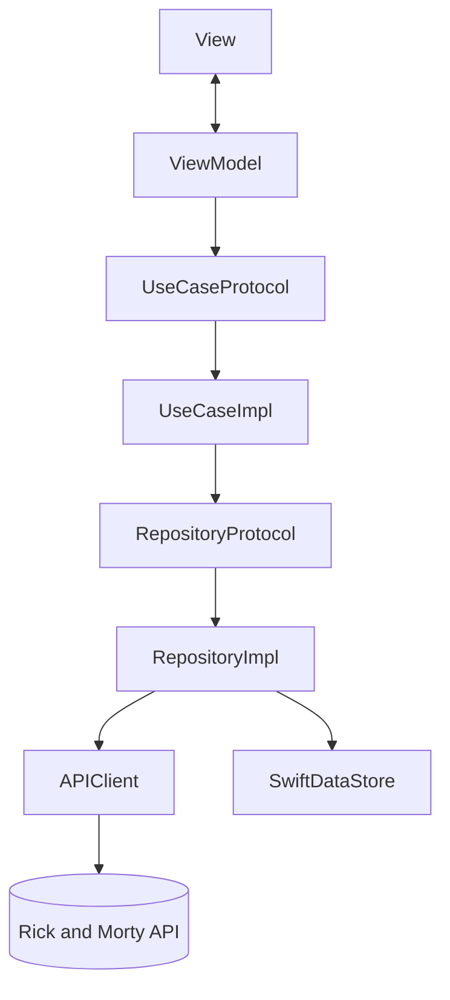

## RickVerse Project Specifications

🛸 **SwiftUI Demo App** built on the Rick and Morty API to practice Clean Architecture + AI-assisted iterative development.

---

## 📌 Problem (Core Idea)

Learning a new dev workflow (AI-assisted, iterative, lesson-by-lesson) is easiest with a small but "real" domain — not a todo list. Rick and Morty gives:

- A public API with no auth/keys required
- Multiple related entities (characters, episodes, locations)
- Built-in pagination and filtering to practice real network patterns
- A fun, low-stakes domain that doesn't need business validation

➡️ **RickVerse is a self-contained iOS playground for practicing Clean Architecture, MVVM + Coordinator, and AI-assisted development, one vertical slice at a time.**

---

## 🧑‍💻 Users

| Persona            | Needs                                                         |
| ------------------ | -------------------------------------------------------------- |
| Solo iOS developer  | A repeatable architecture skeleton to re-practice per feature   |
| AI coding assistant | Clear conventions & module boundaries to generate aligned code |
| Future interviewer  | A readable sample project demonstrating architecture decisions |

---

## ✨ Core Features

### A) Content Types (from Rick and Morty API)

- Character (name, status, species, gender, origin, location, image, episodes)
- Episode (name, air date, episode code, characters)
- Location (name, type, dimension, residents)

### B) Screens (10)

- Splash (always first — app launch, quick data/config warm-up, then routes to Root)
- Characters List (paginated, infinite scroll)
- Character Detail (info + episodes list)
- Episodes List (grouped by season)
- Episode Detail (info + characters strip)
- Locations List (paginated)
- Location Detail (info + residents)
- Favorites (SwiftData-backed, offline)
- Search & Filter (name search + status/species/gender filters)
- Settings (theme, clear favorites cache, about)

### C) Search & Filter

Query-param based, hitting the API's built-in filter support:

- By name (debounced)
- By status / species / gender

### D) Favorites (Offline-capable)

- SwiftData-backed local storage
- Stores a snapshot (id, name, image URL, status) so Favorites works fully offline
- Toggle from Character Detail

### E) Additional Features

- Pull-to-refresh
- Empty / error / loading states per screen
- Batch episode fetch (`/episode/1,2,3`) to avoid N+1 requests
- Dark mode first

### F) Out of Scope (not needed for a demo)

- Authentication
- Monetization / paywalls
- Backend / custom server
- Push notifications

---

## 🗄️ Data Model (SwiftData Draft)

> Domain entities are plain structs; only Favorites is persisted. Schema will evolve.

```swift
// Domain (pure, no persistence/network dependency)
struct Character: Identifiable, Equatable {
    let id: Int
    let name: String
    let status: Status       // alive | dead | unknown
    let species: String
    let gender: String
    let imageURL: URL
    let episodeIDs: [Int]
    let locationName: String
}

struct Episode: Identifiable, Equatable {
    let id: Int
    let name: String
    let airDate: String
    let episodeCode: String   // e.g. "S01E01"
    let characterIDs: [Int]
}

struct Location: Identifiable, Equatable {
    let id: Int
    let name: String
    let type: String
    let dimension: String
    let residentIDs: [Int]
}

// Persistence (SwiftData)
@Model
final class FavoriteCharacter {
    @Attribute(.unique) var id: Int
    var name: String
    var imageURLString: String
    var status: String
    var dateAdded: Date

    init(id: Int, name: String, imageURLString: String, status: String) {
        self.id = id
        self.name = name
        self.imageURLString = imageURLString
        self.status = status
        self.dateAdded = .now
    }
}
```

---

## 🧱 Tech Stack

| Category      | Choice                                    |
| ------------- | ----------------------------------------- |
| Language      | Swift 6                                   |
| UI            | SwiftUI                                   |
| Architecture  | Clean Architecture (Presentation/Domain/Data) + MVVM + Coordinator |
| Persistence   | SwiftData                                 |
| Networking    | URLSession + async/await                  |
| API           | Rick and Morty API (rickandmortyapi.com)  |
| Testing       | Swift Testing                             |
| Min iOS       | iOS 17+                                   |
| Dependencies  | Kingfisher (image loading/caching)        |

---

## 🧩 Module Structure

Layer-first: Clean Architecture layers at the top level, features grouped inside Presentation. The folder tree mirrors the dependency direction (Presentation → Domain ← Data).

```
RickVerse/
├── App/                          # rick_verseApp, DI container, AppCoordinator
├── Presentation/
│   ├── Characters/
│   │   ├── CharactersCoordinator.swift
│   │   ├── List/                 # CharactersListView + ViewModel
│   │   └── Detail/               # CharacterDetailView + ViewModel
│   ├── Episodes/
│   │   ├── EpisodesCoordinator.swift
│   │   ├── List/
│   │   └── Detail/
│   ├── Locations/
│   │   ├── LocationsCoordinator.swift
│   │   ├── List/
│   │   └── Detail/
│   ├── Favorites/
│   │   ├── FavoritesCoordinator.swift
│   │   └── ...
│   ├── Search/
│   ├── Settings/
│   │   ├── SettingsCoordinator.swift
│   │   └── ...
│   ├── Splash/
│   └── Common/                   # reusable views, modifiers, styles
├── Domain/
│   ├── Entities/                 # Character, Episode, Location — pure structs
│   ├── UseCases/                 # protocol + Default impl, one file each
│   └── Repositories/             # protocols only
├── Data/
│   ├── Network/                  # APIClient, endpoints, DTOs + mappers
│   ├── Persistence/              # SwiftData stack, FavoriteCharacter
│   └── Repositories/             # protocol implementations
└── Resources/                    # assets, Info.plist
```

### Use Case Convention

- ViewModels depend on use case **protocols**, never on implementations — required for unit-testing ViewModels with trivial mocks.
- Protocol and its default implementation live in **one file**: `Domain/UseCases/FetchCharactersUseCase.swift` contains `protocol FetchCharactersUseCase` + `struct DefaultFetchCharactersUseCase`.
- Keep protocols narrow: a single `execute` method per use case.
- Don't create a use case when there is no orchestration — trivial pass-throughs may call the repository directly. A use case earns its place when it composes logic (e.g. batch episode fetch `/episode/1,2,3` on top of the repository).

### Coordinator Convention

- **One coordinator per flow (= per tab = per NavigationStack)**, not per screen: `CharactersCoordinator`, `EpisodesCoordinator`, `LocationsCoordinator`, `FavoritesCoordinator`, `SettingsCoordinator`.
- A flow coordinator is an `@Observable` object owning `path: [Route]`, its feature's `Route` enum, and screen-building via `navigationDestination`.
- ViewModels know nothing about navigation — they call their coordinator (or emit events via closures) and the coordinator decides.
- `AppCoordinator` stays thin: splash → tabs routing, tab selection, holding the five child coordinators. Cross-tab navigation (e.g. Favorites → Character Detail in the Characters tab) goes through `AppCoordinator` — the only place it is allowed.

---

## 🎨 UI / UX

- Dark mode support
- TabView root: Characters / Episodes / Locations / Favorites / Settings
- Push navigation within each tab
- Skeleton/shimmer loading states
- Kingfisher for character/location images


---

## 🔌 API Architecture



---
